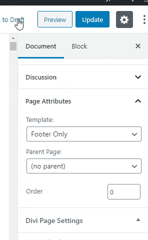

# Divi Child Theme

A Child Theme for Divi. According to WordPress.ORG, "A child theme allows you to change small aspects of your site’s appearance yet still preserve your theme’s look and functionality."

## Advantages of Child Theme

**Update Parent Theme without Losing Past Customization**
If you update the parent theme, all of your past customization will be remain intact if you customize your website through the *Child Theme*

**Easy to Add Back-end Functionalities**
You can add custom back-end functionalities very easily which is not aliged with your parent theme.

**Easy to Update Layout, Look & Feel**
You can take copy of any template from the parent theme and paste it into your *Child Theme* modify it exactly you want. For example, if you want a different *Page Layout* on your website, you can take copy of existing *page.php* template from the parent theme and paste it into your *Child Theme* and you've to rename it e.g: *page-custom.php* and then you can easily update the template exactly you want. Also you can overwrite paretn theme's *CSS Rules* write your own *JavaScript*, you can add your own *Fonts* or *Google Fonts* and much more.

## How to Create a Page OR *Page Template* without Header & Navigation Menu in Divi Theme
To achive above example, you've to copy & paste your *page.php* into your *Child Theme* from your parent theme, and then you've to rename it e.g: *page-no-header.php* (you can name it anything). And on the template header just give it an *unique* name like this example:
/\*
 *Template Name: No Header*
 \*/

Now if you want to create a new page without the *Header*, look for an option called "Page Attributes" on the right sidebar & choose *No Header* as your page template and hit save.

If you want to remove the *Header* from an existing page, go to *Edit Page* and look for an option called "Page Attributes" from the right sidebar and just select the *No Header* template and hit the button "Update".

That's it!

## How to Use Text as the Logo in Divi Theme
You can also use *text logo* in Divi theme. In this case, your website *name* will be the *text logo*. Navigate to **Settings => General => Site Title** and write the text you want as your logo.
NB: Reset or remove the existing **image** logo if you already have one.
*If image logo has been uploaded then image logo will be shown instead of site-title. Site-title will work as a text logo only when you'll not have an existing image logo already in place.*

*Thank you,
Shihab Ul Haque,
Web Designer & Developer,
Profile on: [Fiverr](https://www.fiverr.com/shihabiiuc),
Profile on: [Upwork](https://www.upwork.com/freelancers/~01a9f777bf29c61bb1).*

*Interested in a discussion? [Book a schedule](https://calendly.com/shihabdinajpur/client-meeting/), it's free!*